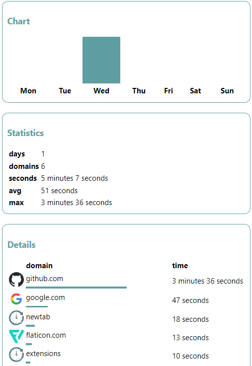

# TimeGaze

**TimeGaze** is a Chrome extension designed to help you monitor and manage your screen time effectively. Stay productive and keep track of the time you spend on different websites with ease.

 
 


## Table of Contents
- [Introduction](#introduction)
- [Problem it Solves](#problem-it-solves)
- [Tech Stack](#tech-stack)
- [Screengrabs](#screengrabs)
- [Scalability](#scalability)
- [Setup Guide](#setup-guide)
- [Contribution Guidelines](#contribution-guidelines)
- [License](#license)

## 💙 Introduction

### TimeGaze

TimeGaze is a browser extension developed to help users effectively manage their screen time, ensuring a healthy and balanced online experience.

## 💡 Problem it Solves

In today's digital age, it's easy to lose track of time spent on various websites. TimeGaze provides users with detailed insights and control over their online activities, promoting productivity and healthier screen habits.

## 📍 Tech Stack

- JavaScript
- HTML
- CSS

## 📷 Screengrabs



## 🌺 Scalability

The project can be scaled to include features such as:

- Detailed analytics and insights
- Integration with other productivity tools
- Enhanced customization options for alerts and reports

## 🔨 Setup Guide

To set up the local project environment:

1. Clone the repository:
    ```bash
    git clone https://github.com/kratika-singh/TimeGaze.git
    ```
2. Open Chrome and navigate to `chrome://extensions/`.
3. Enable "Developer mode" in the top right corner.
4. Click on "Load unpacked" and select the `TimeGaze` directory.

## 🤝 Contribution Guidelines

We welcome contributions! Please follow these steps:

1. Fork this repository and clone it:
    ```bash
    git clone https://github.com/kratika-singh/TimeGaze.git
    ```
2. Add a reference (remote) to the original repository:
    ```bash
    git remote add upstream https://github.com/kratika-singh/TimeGaze.git
    ```
3. Check the remotes for this repository:
    ```bash
    git remote -v
    ```
4. Always pull from the upstream repository to keep your master branch updated:
    ```bash
    git pull upstream main
    ```
5. Create a new branch:
    ```bash
    git checkout -b <your_branch_name>
    ```
6. Perform desired changes to the code base and track your changes:
    ```bash
    git add .
    git status
    ```
7. Commit your changes:
    ```bash
    git commit -m "Relevant message"
    ```
8. Push the committed changes in your feature branch to your remote repository:
    ```bash
    git push -u origin <your_branch_name>
    ```
9. To create a pull request, click on "Compare & pull requests" and add an appropriate title and description explaining your changes. Click on "Create pull request".

## 📜 License

This project is licensed under the MIT License. See the [LICENSE](LICENSE) file for details.
